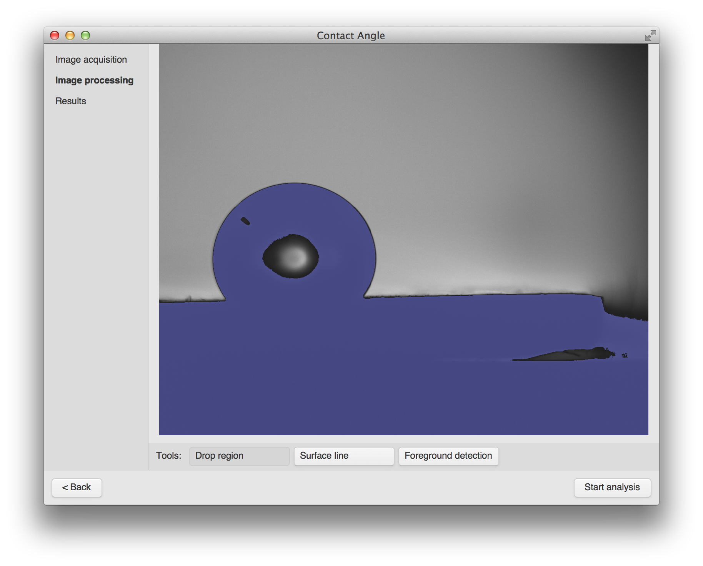
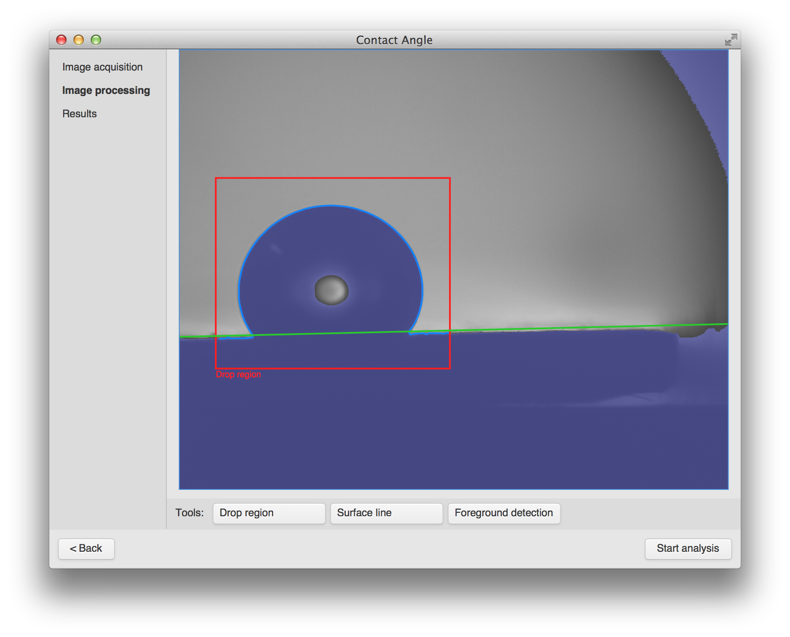
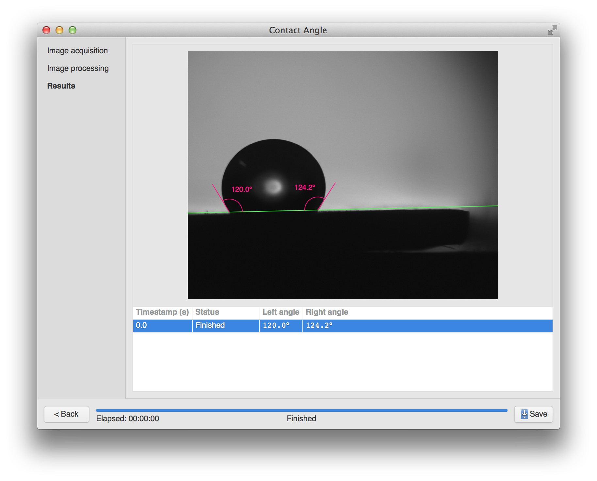
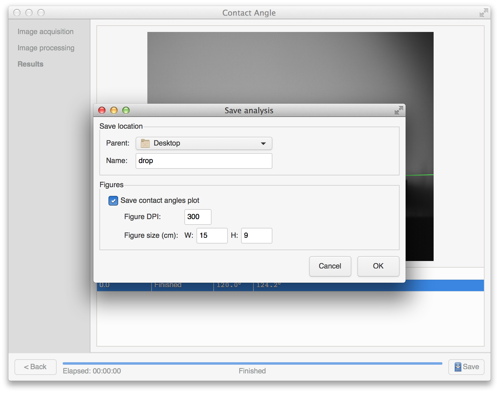
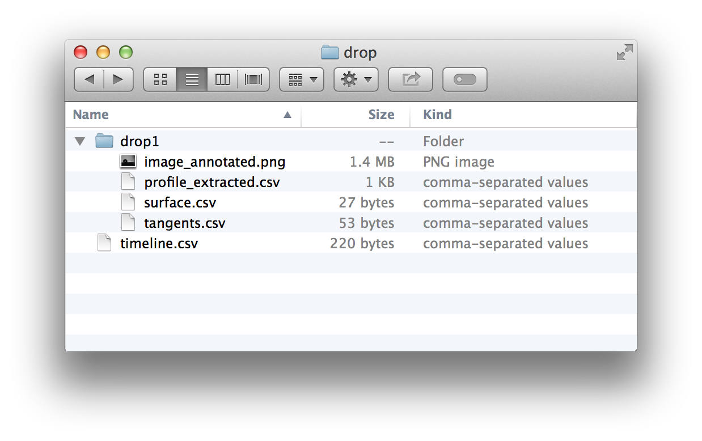
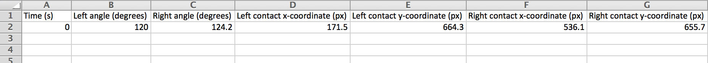
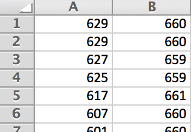
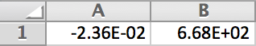
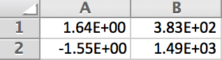

Contact Angle
=============

A wizard-style window will guide you through the process of performing a contact angle analysis.

Image acquisition
-----------------

The contact angle image acquisition page is the same as the one for interfacial tension analyses.

Image processing
----------------

The image processing window requires you to define the 'drop region' and 'surface line' of the image. Click on the 'Drop region' button in the 'Tools' panel then drag over the image preview to define the region. Similarly, click on the 'Surface line' button and drag a line to define the surface that the drop is sitting on. With the 'Surface line' button depressed and the preview widget focused, use the arrow keys for finer adjustments of the surface line.

Once the drop region is defined, a blue outline will be drawn over the preview showing the drop profile that has been extracted.

The intersection angle between the drop profile and the surface line will be the contact angle measured.

In a contact angle analysis, OpenDrop uses image thresholding to separate the foreground from the background. Click on the 'Foreground detection' button to open a dialog bubble which will allow you to adjust the threshold value. A blue overlay is painted over parts of the image deemed to be in the foreground.

Click on 'Start analysis' to begin analysing the input images, or begin capturing and analysing images if using a camera.

Results
-------

The results page for a contact angle analysis is quite simple.

A summary table is shown on the bottom half with a results visualizer on the top half. Graphs of the left and right contact angles are also available if more than one image is analysed.

Saving
------

Once an analysis is finished, click on the 'Save' button in the footer to open the save dialog. All data will be saved in a folder with name determined by the 'Name' entry, and in a parent directory determined by the 'Parent' selection. 

As a convenience, you may choose to save some pre-made plots.

An example save output is shown above, and screenshots of the contents of some files are shown below. (All coordinates are with respect to the origin being on the top-left corner of the image with increasing x and y in the right and down directions respectively.)

    timeline.csv

    drop1/profile_extracted.csv (each row is an (x, y) coordinate pair)

    drop1/surface.csv (The coefficients of the surface line; first column is gradient, second column is y-intercept)

    drop1/tangents.csv (The coefficients of the tangent lines at the contact point. First row is left tangent, second row is right tangent. First column is gradient, second column is y-intercept)