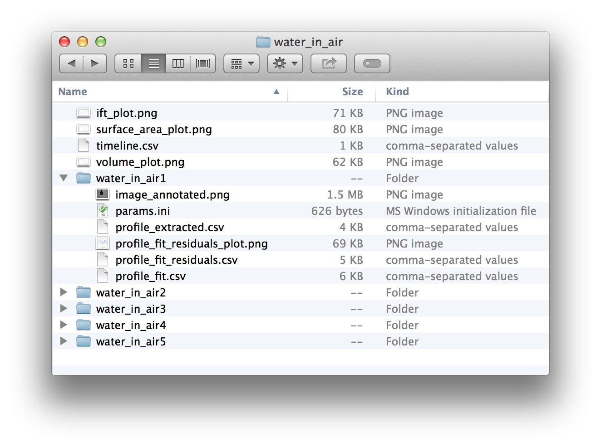

Interfacial Tension
===================

A wizard-style window will guide you through the process of performing an interfacial tension analysis.

Image acquisition
-----------------

First, choose an image input method. OpenDrop currently supports opening images from the local filesystem or capturing images with a USB camera.

Local filesystem
^^^^^^^^^^^^^^^^

Click on 'Choose files' to open the file chooser dialog and select an individual image or a sequence of images. When analysing a sequence of images, 'Frame interval' refers to the time interval (in seconds) between each image. Sequences of images are ordered in lexicographic order.

USB camera
^^^^^^^^^^

Click on 'Connect camera' to open the camera chooser dialog.

OpenDrop uses OpenCV to capture images from a connected camera. 'Camera index' refers to the device index argument passed to the OpenCV function ``cv2.VideoCapture()``. An index of 0 refers to the first connected camera (usually a laptop's in-built webcam if present), an index of 1 refers to the second camera, and so on. Currently, there does not appear to be a way in OpenCV to query a list of valid device indices and associated device names, so in a multi-camera setup, some trial-and-error is required.

'Frame interval' refers to the time interval (in seconds) between capturing images.

Physical parameters
-------------------

'Inner density' refers to the density of the drop.

'Outer density' refers to the density of the surrounding medium.

'Needle diameter' refers to the diameter of the needle the drop is suspended from.

'Gravity' refers to the gravitational acceleration.

Image processing
----------------

The image processing window requires you to define the 'drop region' and 'needle region' of the image. Click on the 'Drop region' or 'Needle region' buttons in the 'Tools' panel, then drag over the image preview to define the associated region.

Once each region is defined, a blue outline will be drawn over the preview showing the drop or needle profile that has been extracted.

OpenDrop uses OpenCV's Canny edge detector to detect edges in the image, click on the 'Edge detection' button in the 'Tools' panel to open a dialog bubble which will allow you to adjust the lower and upper threshold parameters of the Canny edge detector. Thin blue lines are drawn over the preview to show detected edges.

The extracted needle profile is used to determine the diameter in pixels of the needle in the image. Along with the needle diameter in millimetres given in the 'Physical parameters' page, a metres-per-pixel scale can be determined, which is then used to derive other physical properties of the drop after the image is analysed.

Click on 'Start analysis' to begin analysing the input images, or begin capturing and analysing images if using a camera.

Results
-------

The results page shows the current status of the analysis. Data shown in the window is updated as the analysis progresses.

There are two main views, the 'Individual Fit' view and the 'Graphs' view. The 'Graphs' view is not available when analysing a single image.

Individual Fit
^^^^^^^^^^^^^^

The 'Individual Fit' view shows analysis details for an individual image. Pick an analysis in the lower panel to preview its details in the upper panel.

The 'Drop profile' tab on the right of the upper panel shows the fitted drop profile (drawn in magenta) over the extracted drop profile (drawn in blue).

The 'Fit residuals' tab shows a plot of the fit residuals. The horizontal axis is the 'drop profile parameter', ranging from 0 to 1, with 0 corresponding to one end of the drop edge outline, and 1 corresponding to the other end. The vertical axis is some dimensionless quantity indicating the deviation of the extracted profile from the fitted profile.

The 'Log' tab shows the history of any messages logged by the fitting routine.

Graphs
^^^^^^

The 'Graphs' view shows plots of interfacial tension, volume, and surface area over time.

Cancel or discard analysis
^^^^^^^^^^^^^^^^^^^^^^^^^^

You may cancel an in progress analysis by clicking on the 'Cancel' button in the footer (not shown in the screenshots above). To discard the results of a finished analysis, click the 'Back' button, which will return you to the 'Image processing' page, or close the window to return to the Main Menu.

Saving
------

Once an analysis is finished, click on the 'Save' button in the footer to open the save dialog. All data will be saved in a folder with name determined by the 'Name' entry, and in a parent directory determined by the 'Parent' selection. 

As a convenience, you may choose to save some pre-made plots.

An example save output is shown above, and screenshots of the contents of some files are shown below.

    timeline.csv

    water_in_air1/profile_fit.csv (each row is an (x, y) coordinate pair)

    water_in_air1/profile_extracted.csv (each row is an (x, y) coordinate pair)

    water_in_air1/profile_fit_residuals.csv (first column is 'drop profile parameter', second column is residual)

    water_in_air1/params.ini
